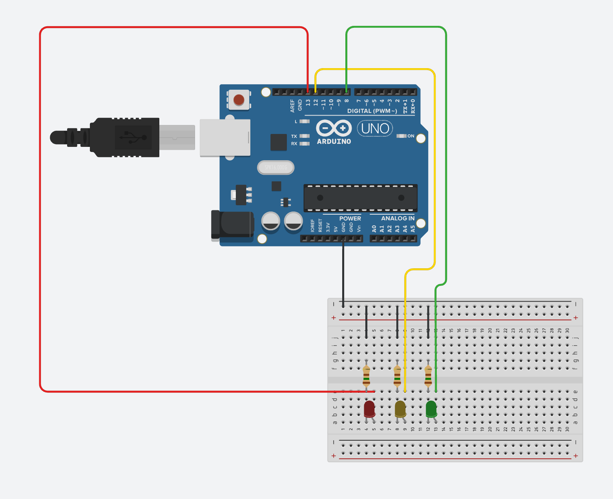

# 🚪MY_FRONT_DOOR
## Demo

## Environment
- OS: MacOS, Raspbian
- SKILL : 
    - LANGUAGE &ensp;: Python3, C
    - LIBRARY &ensp; &ensp;&ensp;: OpneCV, WiringPi
    - DOCS  &ensp; &ensp; &ensp; &ensp; : YAML
## Description
OpenCV와 라즈베리파이를 이용한 얼굴인식 잠금 해제 장치

OpenCV에서 제공하는 모델을 이용하여 나의 얼굴을 학습하고 얼굴을 확인하는 동안 노란색 LED가 활성화되고, 얼굴이 일치하면 초록색 LED가 활성화, 불일치 빨간색 LED가 활성화되는 것으로 표현

- hardware spec :
    - single board: RaspberryPi4
    - camera : Hansung HW10 FHD for Hello 웹캠

---
**Presentation** : [slide](https://www.figma.com/deck/5LZyBV6V5nJU8HABgzfU5F/HOME-IoT-Python?node-id=2001-55&t=nF6WKXo8afu3HhRC-1)